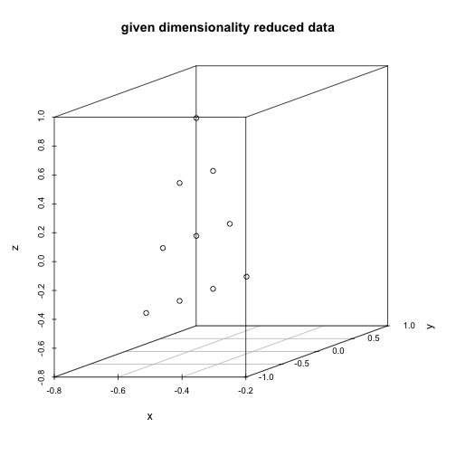
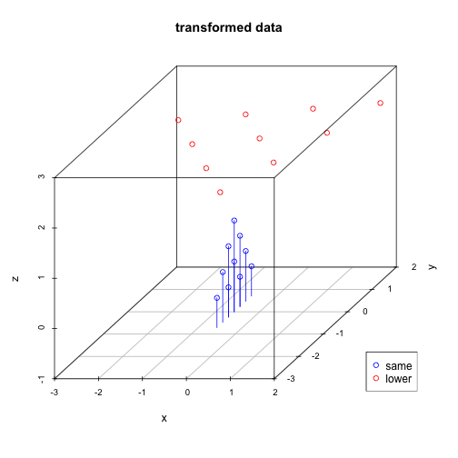
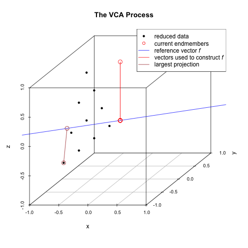
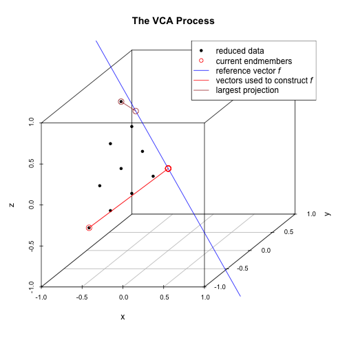
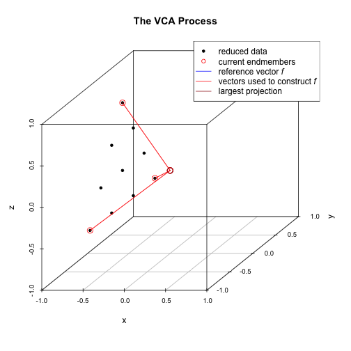

<!--
%\VignetteEngine{knitr::knitr}
%\VignetteIndexEntry{VCA with unmixR}
%\VignetteKeywords{hyperspectral unmixing, vertex component analysis, VCA}
%\VignetteDepends{plot3D, scatterplot3d}
 -->

VCA with unmixR
===============

Anton Belov, July 1, 2016


```r
    library(plot3D)
    library(hyperSpec, quietly = TRUE)
```

```
## Use suppressPackageStartupMessages() to eliminate package startup
## messages.
```

```
## Package hyperSpec, version 0.98-20161118
## 
## To get started, try
##    vignette ("introduction", package = "hyperSpec")
##    package?hyperSpec 
##    vignette (package = "hyperSpec")
## 
## If you use this package please cite it appropriately.
##    citation("hyperSpec")
## will give you the correct reference.
## 
## The project homepage is http://hyperspec.r-forge.r-project.org
```

```r
    d <- unmixR:::.testdata$x
    str(d)
```

```
##  AsIs [1:10, 1:3] 0 1 2 3 0 1 2 0 1 0 ...
##  - attr(*, "dimnames")=List of 2
##   ..$ samples    : chr [1:10] "1" "2" "3" "4" ...
##   ..$ wavelengths: chr [1:3] "L1" "L2" "L3"
```

```r
    scatter3D(d[, 1], d[, 2], d[, 3], pch = 20, col = matlab.dark.palette(), phi = 50, theta = 110)
```


## Dimensionality Reduction

The algorithm uses two dimensionality reduction techniques. The choice depends on the signal to noise ratio of data. The threshold value is equal to $15 + 10 \log p$ The dimensionality reduction function not only reduces dimensionality of data but also transforms it to amplify noise.


```r
    library(unmixR, quietly = TRUE)
    dim(d)
```

```
## [1] 10  3
```

```r
    endNum <- 3
    snrThreshhold <- 15 + 10 * log10(endNum)
    sameReduced <- dimensionalityReduction(d, endNum, snrThreshhold + 1)
    lowerReduced <- dimensionalityReduction(d, endNum, snrThreshhold - 1)
```

## Plotting the Data


```r
    library(scatterplot3d, quietly = TRUE)
    colnames(sameReduced) <- c("x", "y", "z")
    colnames(lowerReduced) <- c("x", "y", "z")
    scatterplot3d(sameReduced, main = "given dimensionality reduced data")
```




```r
    scatterplot3d(lowerReduced, main = "lower dimensionality reduced data")
```


Using the second approach, the algorithm projects the data onto a subspace of even lower dimensionality and then sets the "missing" dimension values to a certain value. That is why points colored in red have the same z value, because the data was reduced to the dimensionality of 2 (x and y) and then the z value was set to a certain number.


```r
    my3dplot <- scatterplot3d(lowerReduced, color = "red",
      zlim = c(-1, 3), main = "transformed data")
    my3dplot$points3d(sameReduced, type = "h", col = "blue")
    legend(x = "bottomright", pch = 1, col = c("blue", "red"),
      legend = c("same", "lower"))
```



Since the noise in this example is very low the algorithm will use the first approach.

## The VCA Process, Illustrated

The VCA algorithm works as follows:

1. The data is reduced to a dimensionality equal to $p$ where $p$ is the desired (estimated) number of endmembers.  As mentioned above, the details of the reduction depend upon the signal-to-noise ratio of the raw data.
2. Initialize $A$, a $p \times p$ matrix that will store the endmembers. The first column is set to a constant, which represents an initial "fake" endmember to get the process started.
3. For $i$ from 1 to $p$:
   + Calculate a reference vector orthogonal to the subspace spanned by columns of $A$.  This vector will pass through (0,0,...,0).
   + Project all the data points onto this reference vector.
   + Find which data point's projection  onto the reference vector is furthest from the origin.  This is equivalent to the data point which has the maximum absolute projection onto the reference vector.
   + Let $k$ be the index of that data point in the dataset.  Set the $i$-th column of $A$ to $k$-th column of data.  This is one of the endmembers.
4. Return $A$.


The following plots illustrate the process for a 3-dimensional data set consisting of a number of points which lie on a plane and form a triangle.  

The system is initialized with a "fake" endmember with coordinates $(0,0,1)$ and a reference vector $f$ which is orthogonal to this endmember (point) is computed.  Then, each data point is projected onto this reference vector.  The data point whose projection intersection with $f$ is farthest from the origin is selected as the first (real) endmember (and the fake endmember is discarded).  The next plot shows these steps.  The first endmember is at the lower-left.



The first real endmember is then used to construct a new reference vector $f$ and once again the data points are projected onto $f$ and the projection intersection with $f$ which is farthest from the origin is selected as the next endmember.  In the following plot, the 2nd endmember selected is the top-most data point.



With two endmembers identified, we continue the process starting from the most recently identified endmember.  In this next plot, the 3rd endmember is the right-most data point.  It's projection onto the reference vector $f$ is very short and not visible as the data point nearly falls on $f$.  In this plot and the next, we are carrying along the vectors which were used to construct the reference vectors $f$ at each step.


Finally all endmembers have been identified.



If this process were extended to $p$-dimensions, each reference vector $f$ would be a line in the $p$-dimensional space.  Thus the process would be to choose a point, construct an orthogonal vector $f$, and determine which data point has the most extreme projection onto this vector.  That point is chosen as an endmember and the process is repeated until all the desired endmembers have been identified.
